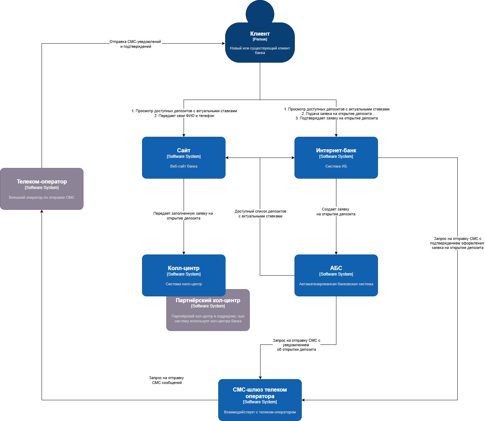
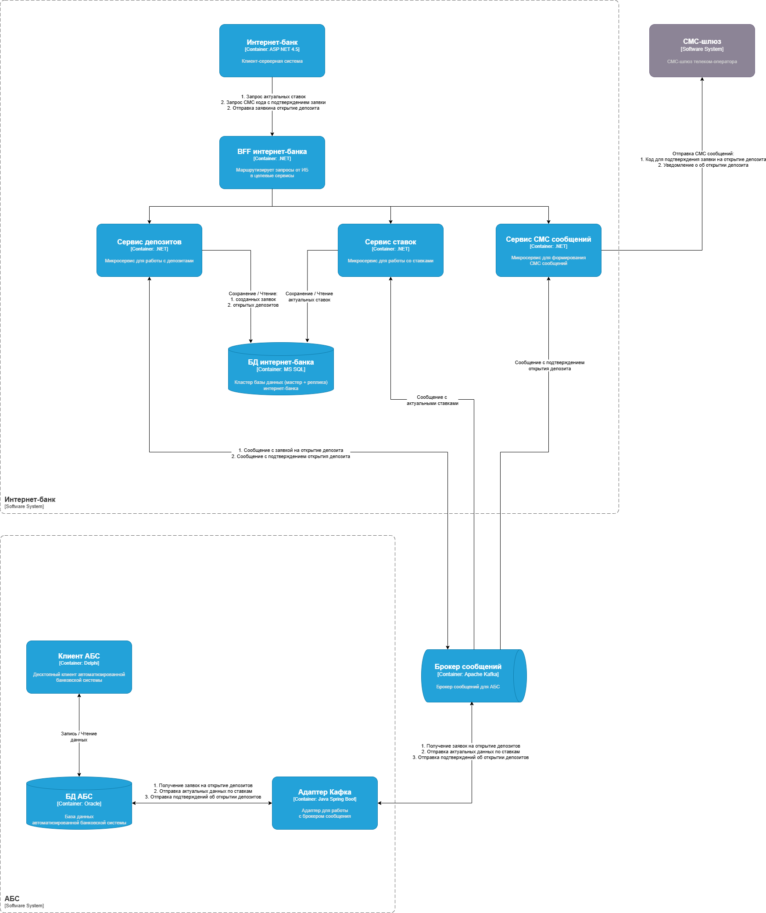

### **Название задачи:**
Задача 3. Открытие депозитов онлайн

### **Автор:**
Фасхутдинов Шамиль

### **Дата:**
19.07.2025

### **Функциональные требования**
| **№** | **Действующие лица или системы** | **Use Case**             | **Описание**                                                                                                                                                                                                                                                           |
|:-----:|:---------------------------------|:-------------------------|:-----------------------------------------------------------------------------------------------------------------------------------------------------------------------------------------------------------------------------------------------------------------------|
|  UC1  | Клиент                           | Подача заявки через сайт | 1. Клиент выбирает интересующий его депозит  2. Вводит ФИО и телефон  3. Данные шифруются и передаются в колл-центр  3. Клиенту звонит сотрудник колл-центра  4. Клиент приходит в отделение банка для идентификации и оформления депозита             |
|  UC2  | Клиент                           | Подача заявки через ИБ   | 1. Клиент выбирает депозит в ИБ, указывая счет и сумму депозита  2. Подтверждает операцию с помощью СМС  3. Заявка на открытие депозита передается в АБС через промежуточное API  в зашифрованном виде  4. Получает СМС с подтверждением открытия депозита |
|  UC3  | Сотрудник колл-центра            | Обработка заявки с сайта | 1. Менеджер видит заявку в системе  2. Звонит клиенту и уточняет детали                                                                                                                                                                                        |
|  UC4  | Сотрудник бек-офиса              | Подтверждение заявки     | 1. Менеджер видит заявку и проверяет ставку в АБС 2. Открывает депозит  3. Отправляет СМС уведомление клиенту об открытии депозита                                                                                                                             |
|       |                                  |                          |                                                                                                                                                                                                                                                                        |

### **Нефункциональные требования**
| **№** | **Требование**                                                                                                        |
|:-----:|:----------------------------------------------------------------------------------------------------------------------|
|   1   | Шифрование данных (TLS/HTTPS) при передаче между системами                                                            |
|   2   | Отклик по всем операциям на сайте и ИБ должен быть ≤ 1 сек.                                                           |
|   3   | Доступность систем 24/7 (99.9% uptime)                                                                                |
|   4   | Запрет прямой интеграции интернет-банка с АБС                                                                         |
|   5   | При доработках во всех системах нужно как можно больше использовать технологии, которые уже есть в банке              |
|   6   | Защита от перегрузки АБС (ограничение числа одновременных запросов)                                                   |
|   7   | Автоматическое переключение на резервный ЦОД при сбое                                                                 |
|   8   | Предусмотреть равномерное горизонтальное масштабирование и распределение запросов между серверами, приложениями и ЦОД |

### **Решение**

1. Используется HTTPS для передачи данных от клиента в ИБ.
2. Реализация MVP строиться на микросервисной архитектуре, где текущее монолитное приложение остается единой точкой входа.
3. Новые микросервисы ИБ реализованы на .NET, базы данных на MS SQL, так как у команды уже есть экспертиза в этой технологии.
4. Для обеспечения отказоустойчивости база данных ИБ должна быть развернута в несколько реплик, а также разработан регламент на случай аварий на основном ЦОД и переключения трафика на сервисы в резервном ЦОДе
5. Чтобы снизить нагрузку на систему АБС со стороны ИБ, необходимо реализовать асинхронное взаимодействие через брокер сообщений (Кафка).
6. Для захвата изменений в таблицах АБС используются триггеры. Триггеры наполняют временные таблицы, которые периодически опрашивает сервис "Адаптер Кафка" и формирует на их основе сообщения в Кафка.
7. Сервис "Адаптер Кафка" написан на Java Spring Boot, так как в команде АБС есть экспертиза в данной технологии

### **Альтернативы**
1. В качестве замены триггерам в базе АБС может быть настроен CDC поток, например Debezium. Но это требует наличие соответствующей экспертизы в Банке.
2. В дополнении к базе данных ИБ для снижения нагрузки можно использовать распределенный кеш для хранения актуальных ставок на день 
и списка открытых репозиториев, например Redis или Hazelcast.  
Но на этапе MVP нагрузка может быть не очень высокой и создание кластера распределенного кеша может быть избыточным, и это также требует наличие соответствующей экспертизы в Банке.
3. В ИБ можно использовать паттерн CQRS для разделения нагрузки на чтение и запись (запись в мастер, чтение с репилик). Но на этапе MVP это кажется избыточным + может стать дополнительной причиной рассогласованности данных.

### **Недостатки, ограничения, риски**
1. Асинхронное взаимодействие между ИБ и АБС обеспечивает снижение нагрузки, но также может приводить к задержкам в получении актуальных данных о депозитах и ставках (временная рассогласованность данных).
2. Брокер сообщений может стать единой точкой отказа, от его отказоустойчивости зависит работоспособность всей системы

