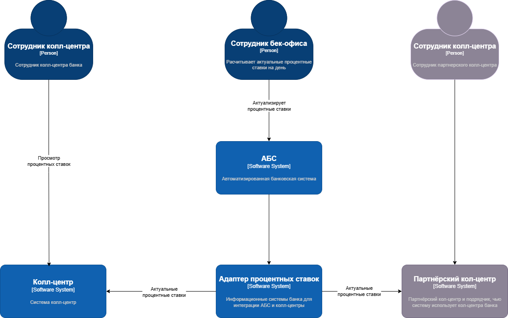
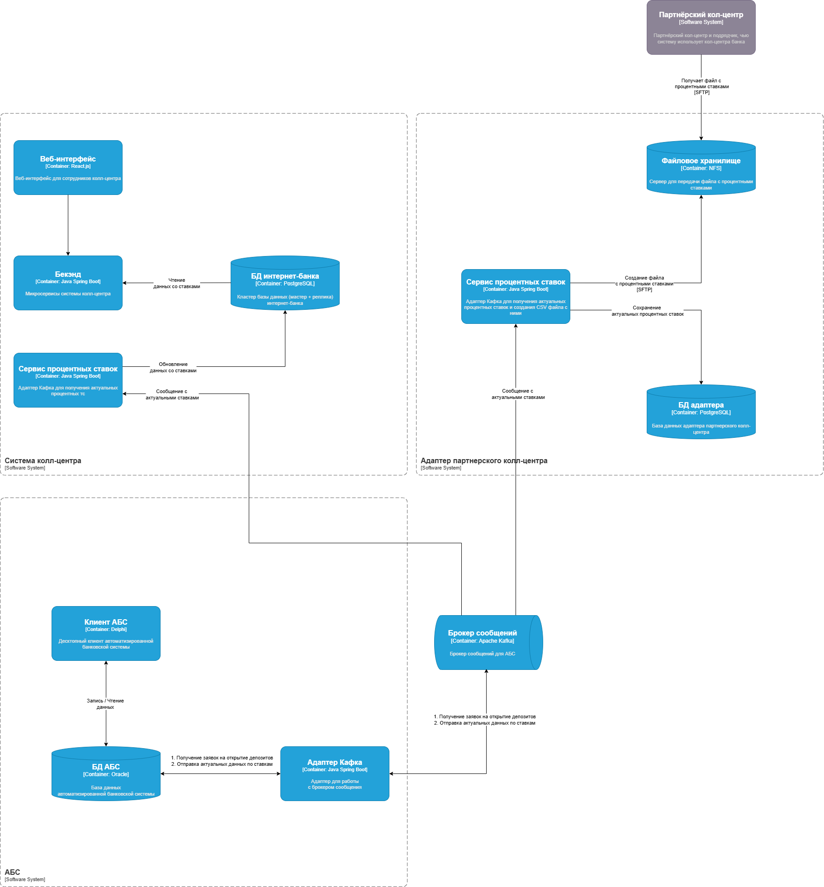

### **Название задачи:**

Задача 4. Передача ставок в кол-центр

### **Автор:**

Фасхутдинов Шамиль

### **Дата:**

19.07.2025

### **Функциональные требования**

| **№** | **Действующие лица или системы**                                                               | **Use Case**         | **Описание**                                                                                                                                                                                                       |
|:-----:|:-----------------------------------------------------------------------------------------------|:---------------------|:-------------------------------------------------------------------------------------------------------------------------------------------------------------------------------------------------------------------|
|  UC1  | Сотрудник бек-офиса,  АБС,  система колл-центра,  система партнерского колл-центра | Обновление ставок    | 1. Вносит актуальные ставки по депозитам в АБС  2. Ставки автоматически подгружаются напрямую в CRM колл-центра  3. Информация из файла с актуальными ставками подгружается в CRM партнерского колл-центра |
|  UC2  | Клиент,  Сотрудник колл-центра,  Сотрудник партнерского колл-центра                    | Консультация клиента | 1. Клиент звонит в колл-центра  2. Сотрудник колл-центра просматривает актуальные ставки в системе  3. Информирует клиента об актуальных ставках                                                           |

### **Нефункциональные требования**

| **№** | **Требование**                                                                                                         |
|:-----:|:-----------------------------------------------------------------------------------------------------------------------|
|   1   | Данные об актуальных ставках передаются в партнерский колл-центра в виде файлов по SFTP протоколу                      |
|   2   | Данные об актуальных ставках передаются в колл-центра напрямую в CRM систему колл-центра                               |
|   3   | Не нагружать систему АБС                                                                                               |
|   4   | У системы партнерского колл-центра нет возможности сделать API-вызовы для получения актуальных процентных ставок банка |

### **Решение**

1. В систему колл-центра банка добавляется еще один микросервис "Сервис процентных ставок".  
Его задача - вычитывать из топика Кафка (из Задачи 3) информацию об изменениях актуальных ставок и сохранять ее в существующую БД. Запрос на получение ставок идет из существующих микросервисов колл-центра.
2. Новый микросервис колл-центра банка на Java Spring Boot, существующая база данных - PostgreSQL. Так как данные технологии уже используются в этой системе и у подрядчика есть экспертиза в них.
3. Для передачи актуальных ставок в партнерский колл-центр было принято решение создать отдельную АС "Адаптер партнерского колл-центра". В ней создается микросервис "Сервис процентных ставок".  
Его задача - вычитывать из топика Кафка информацию об изменениях актуальных ставок и сохранять ее в новую БД, а затем отдельным фоновым процессом записывать их в CSV файл и выкладывать на файловую шару.  
4. Микросервис на Java Spring Boot, база данных - PostgreSQL. Так как с большой долей вероятности, данная АС будет передана на поддержку и развитие команде колл-центра. А данные технологии уже используются у подрядчика.
5. Система партнерского колл-центра раз в сути забирает файл со ставками из файловой шары (после вычитки файл удаляется) и каким-то образом вносит информацию в свою систему (описание процесса не входит в скоуп этой задачи). 
6. Все обращения (запись/чтение) в файловую шару идет по протоколу SFTP

### **Альтернативы**

1. В системе колл-центра может быть создана отдельная БД для работы с процентными ставками, а чтение/запись в эту БД идти только через новый сервис "Сервис процентных ставок"  
или даже разделить потоки чтения и записи по разным микросервисам (Database per Service pattern). Но на этапе MVP было решено не усложнять систему, при необходимости это можно будет реализовать позднее
2. Также для снижения нагрузки на БД колл-центра можно использовать распределенный кеш для хранения актуальных ставок на день и списка открытых репозиториев, например Redis или Hazelcast.  
Но на этапе MVP нагрузка может быть не очень высокой и создание кластера распределенного кеша может быть избыточным, и это также требует наличие соответствующей экспертизы в Банке.
3. Для упрощения архитектурной схемы и сроков реализации MVP можно отказаться от отдельной АС "Адаптер партнерского колл-центра" и весь его функционал реализовать в новом микросервисе и существующей БД колл-центра банка.  
Но было решено не смешивать различный функционал и зоны ответственности в одной системе. Но сама система вполне может быть отдана на разработку и поддержку команде колл-центра банка.

### **Недостатки, ограничения, риски**

1. Асинхронное взаимодействие между системами и АБС обеспечивает снижение нагрузки, но также может приводить к задержкам в получении актуальных данных о ставках (временная рассогласованность данных).
2. Брокер сообщений может стать единой точкой отказа, от его отказоустойчивости зависит работоспособность всей системы
3. Сетевое файловое хранилище как дополнительная точка отказа
4. Временная неконсистентность данных о ставках в партнерском колл-центре и колл-центре банка, возможные расхождения в данных в случае ошибок маппинга, сериализации/десериализации информации в/из CSV файла 

